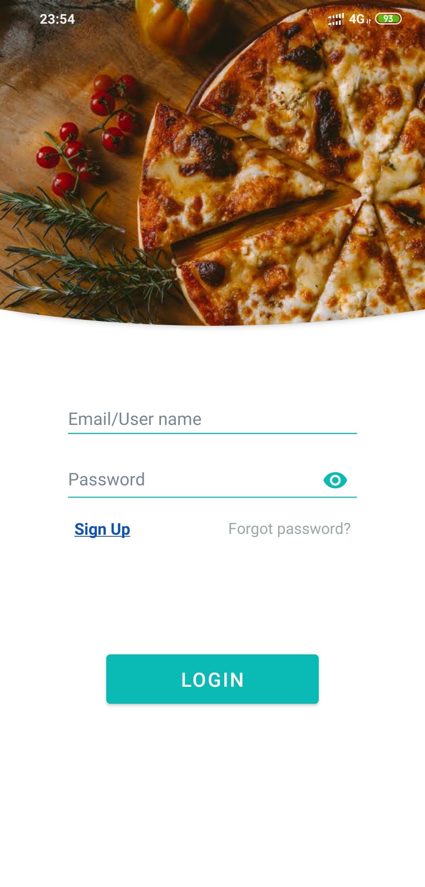

# MaterialUI-Android-App
It is a mobile application that perform all database operations CRUD [Create, Read, Update, Delete DATA]. Also there is login and register operations in this app. Backend I have used SLIM Framewok (PHP).)

## Login activity

